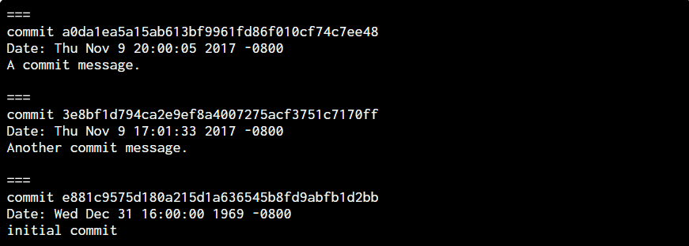
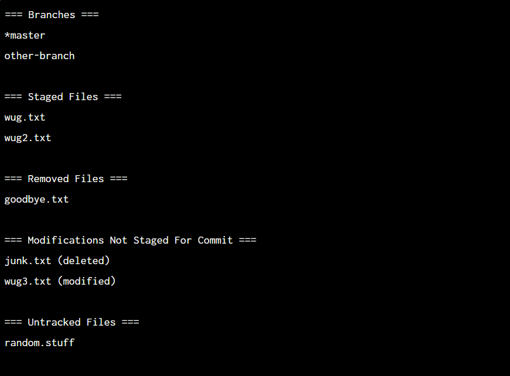

# gitlet需求整理

[TOC]

---

## 1. 整体目标

project 2需要实现一个玩具版的git版本控制系统，称为gitlet，这个迷你版本控制系统需要支持：

1. 保存整个目录中所有文件的内容(也可以是单个文件)，我们称之为*committing*，单次对目录和文件的快照称为*commit*；
2. 给出指定版本，可以恢复出该版本里某个或者多个文件的内容，我们称之为*checking out*；
3. 浏览所有历史快照记录，我们管这些历史记录叫做*logs*；
4. 维护相互关联的commit序列，我们管这种序列叫*branches*；
5. 将一个branch中记录的文件内容的变动合并到另一个branch中，我们称之为*merging*；

> 关键词：***commit***, ***check out***, ***log***, ***branch***, ***merge***

---

## 2. 错误处理

部分命令会给出对应的错误/异常行为发生时需要抛出的信息，还有一部分错误/异常信息不依赖于具体的命令，而是由用户的部分行为触发——这些异常信息在抛出的同时会中断程序当前操作，并且不修改系统状态。此外，系统实现的时候**仅需考虑指定的异常**，实现者不应该定义和实现任何其它的异常，以及程序的中断操作。

具体命令对应的错误处理我们会放到“具体命令的需求”这一节去展现，从整个系统的角度而言，实现者应该要考虑以下的错误：

1. 如果用户启动gitlet却没有给出任何参数，打印

   `Please enter a command.`

   并退出(`System.exit(0)`)；

2. 如果用户给出了一条不存在的命令，打印

   `No command with that name exists.`

   并退出(`System.exit(0)`)；

3. 如果用户输入的参数个数或者格式有误，打印

   `Incorrect operands.`

   并退出(`System.exit(0)`)；

4. 如果用户输入的命令依赖于gitlet的初始化，但是当前工作目录内不存在`.gitlet`目录，打印

   `Not in an initialized Gitlet directory.`

   并退出(`System.exit(0)`)；

同时，系统强制要求将argument[0]设置为`System.exit(0)`参数。

---

## 3. 具体命令

以下是gitlet需要支持的具体命令，它们中的绝大多数都对运行时的性能(以时间复杂度为衡量标准)有要求：

### 3.1 init

- 命令：`java gitlet.Main init`
- 职责：将当前目录**初始化**为一个gitlet工作目录，它会：
  - 创建一个`.gitlet`的文件夹；
  - 初始化一个commit，message为`initial commit`，时间戳为“00:00:00 UTC, Thursday, 1 January 1970”，这个commit作为所有commit的祖先；
  - 初始化一个branch，名字为`master`；
- 运行时性能：对任意变量$x$的输入规模$N$（当我们在说“任意变量”时，表名这个变量可以是getlet系统里任意一个对象，例如追踪的文件数，当前branch中提交的commit数等等），都保持$O(1)$常数复杂度
- 失败用例：若当前目录已经初始化，则gitlet退出，同时打印信息`A Gitlet version-control system already exists in the current directory.`
- 是否危险：否

### 3.2 add

- 命令：`java gitlet.Main add [file name]`
- 职责：将指定的文件写入**暂存区(staging area)**：
  - 若该文件已经存入暂存区，则`add`命令会将原有存入的内容用文件的最新内容覆写掉
  - 如果该文件的版本与当前工作目录的版本一致(意味着没有发生变动)，那么`add`命令不应该将该文件加入暂存区，如果该文件已在暂存区内，则删除暂存区中的该文件；
  - 如果该文件已从gitlet的追踪中删除(例如使用了`getlet rm`)命令，那么将该文件暂存区中的内容移除；
- 运行时性能：令$N$为gitlet追踪的文件数，$M$为当前branch中的commit数，时间复杂度上界应为$O(N)$，$O(\lg{M})$；
- 失败用例：如果add的文件不存在，则打印`File does not exist.`，同时退出
- 是否危险：否

### 3.3 commit

- 命令：`java gitlet.Main commit [message]`

- 职责：为当前暂存区中的所有文件以及当前commit中所追踪的文件创建一个**快照**：

  - 默认情况下，一个commit追踪的文件快照应该和它的父commit保持一致；
  - commit不会修改祖辈commit的内容，它在继承祖辈的文件快照时，同时**仅**更新那些在暂存区中的文件所对应快照的内容；
  - commit会为那些祖辈commit中未曾记录，但是在暂存区内新增的文件生成对应的快照；
  - commit中追踪的文件可以被移除(gitlet rm)；

  关于commit命令的注意点有：

  - commit完成后，暂存区需要被清空；
  - commit不会影响工作区文件的内容；
  - 如果追踪的文件内容发生了改变但是没有被加入暂存区，那么commit不会改变该已追踪的文件的内容；
  - commit完成后，commit树中需要新增对应的commit结点；
  - commit命令必须传入message参数，用来描述本次commit，且message参数占据一个参数位，这意味着如果message中间存在空格，需要用引号引住；
  - 每个commit以它的sha1 hash码作为唯一标识id，且必须携带追踪的文件引用、父commit的引用、log message、commit时的时间戳；

- 运行时性能：令$N$为当前分支中的commit数，$M$为所有被追踪的文件数，则`commit`命令的时间复杂度应为对$N$为$O(1)$，对$M$为$O(M)$；同时空间复杂度上，每一次commit增加的文件数不得多于本次暂存区中add进来的文件数量(意思是不要重复添加父commit结点已经维护了的文件)

- 失败用例：

  - 如果暂存区中没有文件，则退出，并打印`No changes added to the commit.`；
  - 如果提交的message参数为空，则退出，并打印`Please enter a commit message.`；
  - 如果工作区内被追踪的文件缺失或者被改动。不会报错(commit仅关注`.gitlet`目录中的内容，换言之，这个错误应该在`commit`的前置环节被处理)；

- 是否危险：否

### 3.4 rm

- 命令：`java gitlet.Main rm [file name]`
- 职责：将存入暂存区的文件移出暂存区或者将已追踪的文件取消追踪并从工作目录中删除
- 运行时性能：对任意给定变量的规模均为常数复杂度$O(1)$
- 失败用例：若给出的文件名既不在暂存区，同时也处于未追踪的状态，则打印`No reason to remove the file.`
- 是否危险：是

### 3.5 log

- 命令：`java gitlet.Main log`

- 职责：从当前的HEAD commit开始向上回溯至初始化时的commit(祖先commit)，如果父结点commit不止一个，则选择第一个父结点继续回溯；对于当前访问的commit结点，打印：

  - 分隔符 “===”
  - commit id(sha1 hash码)
  - (若该commit由两个branch merge而来)merge时所处的branch merge进来的branch
  - commit时间
  - commit message
  - 空行

  下图给出了一个`log`命令的示例：

  

- 运行时性能：令$N$为当前HEAD commit到祖先路径上的结点个数，则`log`命令的时间复杂度应为$O(N)$

- 失败用例：无

- 是否危险：否

### 3.6 global-log

- 命令：`java gitlet.Main global-log`
- 职责：类似`log`命令，区别在于`global-log`命令会打印所有commit的信息，打印的顺序不作强制要求
- 运行时性能：令$N$为所有commit的个数，则`global-log`命令的时间复杂度应为$O(N)$
- 失败用例：无
- 是否危险：否

### 3.7 find

- 命令：`java gitlet.Main find [commit message]`
- 职责：给定commit message，打印出所有commit message为给定参数的commit的id，如果存在多个commit，怎分多行分别打印对应commit的id
- 运行时性能：令$N$为所有commit的个数，则`find`命令的时间复杂度应为$O(N)$
- 失败用例：如果不存在对应给定参数的commit，打印`Found no commit with that message.`
- 是否危险：否

### 3.8 status

- 命令：`java gitlet.Main status`

- 职责：用于展示系统各个模块之间的状态：

  - branch：展现所有当前存在的branch，同时用"*"标记当前的branch；
  - staged area：展现所有已经add进入暂存区的文件；
  - removed file：展现从已经追踪的文件中被删掉的文件；
  - 待暂存的文件：展现已经修改但未加入暂存区的文件，同时标记修改状态(modified/deleted)；
  - 未追踪的文件：展现工作区中既未追踪、又没进入暂存区的文件(不考虑嵌套目录)；

  每个模块的信息在打印完毕后需要添加一行空行，每个模块之间也需要添加一行空行，模块内的文件需要以**字典序**排序后进行展示。下图展现了一个status打印信息的示例：

  

  “待暂存”定义为：

  - 被当前commit追踪，同时文件内容发生更改，但是还未被add进暂存区；
  - add进了暂存区，但是文件内容发生了更改；
  - add进了暂存区，但是文件在工作区内被删除了；
  - 已追踪，但没走gitlet rm删除，而是直接删除的文件；

- 运行时性能：令$M$为工作区内的数据量(因为要分析文件内容是否更改)，$N$为暂存区中的文件数，$T$为分支数，则时间复杂度应为$O(M+N+T)$

- 失败用例：无

- 是否危险：否

### 3.9 checkout

- 命令：
  - `java gitlet.Main checkout -- [file name]`
  - `java gitlet.Main checkout [commit id] -- [file name]`
  - `java gitlet.Main checkout [branch name]`
- 职责：
  - 对于参数为`[file name]`的：在当前HEAD commit中查找追踪的对应文件名，并将文件检出(并覆盖已有文件)到当前工作目录中，检出的文件状态应该为unstaged；
  - 对于参数为`[commit id] -- [file name]`的：在给定commit id对应的commit中查找追踪的对应文件名，并将文件检出(并覆盖已有文件)到当前工作目录中，检出的文件状态应该为unstaged；
  - 对于参数为`[branch name]`的：将对应branch的HEAD commit中所有的文件检出(并覆盖已有文件)到当前工作目录中，切换前分支中追踪的文件需要被删除。检出后，当前的HEAD commit需要指向检出的branch最新的commit，同时清空暂存区；
- 运行时性能：设$M$为检出的文件数，$N$为commit中追踪的文件总数，$P$为commit数，$Q$为branch数，则时间复杂度应为$O(M)$，$O(N)$，对$P$为$O(1)$，对$Q$为$O(1)$
- 失败用例：
  - 对于参数为`[file name]`的：若指定文件不存在于最近一次的commit中，退出，并打印`File does not exist in that commit.`；
  - 对于参数为`[commit id] -- [file name]`的：
    - 若指定commit中不存在指定文件，则退出，并打印`File does not exist in that commit.`；
    - 但如果指定commit不存在，则打印`No commit with that id exists.`；
  - 对于参数为`[branch name]`的：
    - 如果指定branch不存在，打印`No such branch exists.`；
    - 如果指定branch和当前branch一致，打印`No need to checkout the current branch.`；
    - 如果有工作区内存在未追踪文件，但是在待检出的branch中存在对应记录，将被覆写的场景，打印`There is an untracked file in the way; delete it, or add and commit it first.`，并退出；
- 是否危险：是

### 3.10 branch

- 命令：`java gitlet.Main branch [branch name]`
- 职责：创建一个新的branch，并且将HEAD commit指向这个branch。branch本身只是一个commit结点的引用，在初始化gitlet目录的时候，系统会创建一个默认的`master`branch
- 运行时性能：对任意给定变量的规模均为常数复杂度$O(1)$
- 失败用例：如果被创建的branch已经存在，则打印`A branch with that name already exists.`
- 是否危险：否

### 3.11 rm-branch

- 命令：`java gitlet.Main rm-branch [branch name]`
- 职责：删除给出的branch name参数对应的branch。注意，所谓“删除branch”是指只删除branch对应的指针，对于被指向的commit不应做任何删除操作！
- 运行时性能：对任意给定变量的规模均为常数复杂度$\Theta(1)$
- 失败用例：
  - 如果参数branch name对应的branch不存在，则打印`A branch with that name does not exist.`；
  - 如果删除的branch是当前所处的branch，则退出，并打印`Cannot remove the current branch.`；
- 是否危险：否

### 3.12 reset

- 命令：`java gitlet.Main reset [commit id]`
- 职责：
  - 检出给出的commit id参数所对应commit中所有追踪的文件至工作目录；
  - 对于当前工作目录中已追踪但在指定commit中不存在的文件执行删除操作；
  - 将当前分支的指针指向对应的comimt；
  - `reset`命令执行完毕后，清空暂存区；
- 运行时性能：令$N$为给定commit追踪的文件数，$M$为提交的commit总数，则时间复杂度应为$O(N)$，$O(1)$对$M$
- 失败用例：
  - 如果给定的commit id不存在与之对应的commit，则打印`No commit with that id exists.`；
  - 如果当前工作区内存在未被追踪的文件，但会被即将执行的`reset`命令检出的文件覆写，则打印`There is an untracked file in the way; delete it, or add and commit it first.`；
- 是否危险：是

### 3.13 merge

